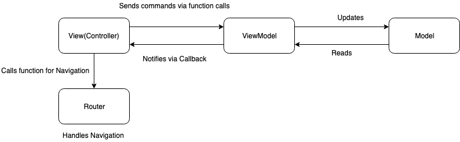
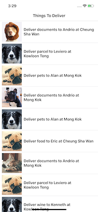
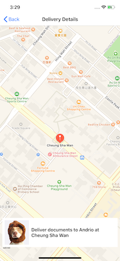

## Delivery iOS App
An iOS app to show deliveries to be made as a list and address details on a Map.

## Getting Started

[Install cocoapods](https://guides.cocoapods.org/using/getting-started.html) and run pod install in the project directory for a quick setup.
```
pod repo update
pod install
```
## Fastlane Setup and Documentation

[Fastlane readme](fastlane/README.md)

## Prerequisites

Mac based system.
Xcode Version 10.3+

## Asumptions

* App supports iPhone devices with iOS10+ only.
* App supports potrait mode only.
* Cached deliveries are the default datasource and all the deliveries from cache are stored at initialization of [deliveryListViewModel](Delivery/Modules/Delivery/ViewModels/DeliveryListViewModel.swift#L45).

* If the number of deliveries received from API are less than the requested amount, it is assumed that there is no more deliveries available from the API and no further calls are made.([here](Delivery/Modules/Delivery/ViewModels/DeliveryListViewModel.swift#L60))

## Running the tests

If you have fastlane installed you can run 'fastlane tests' to intiate testing, otherwise press Cmd+U in Xcode to run the unit tests.
```
fastlane tests
```
There are tests in individual groups to test different layers.

## Coding style 

SwiftLint is used to enforce Swift style and conventions. 

## Design Pattern Used
### MVVM

Model-View-ViewModel (MVVM) is a software design pattern that is structured to separate program logic and user interface controls.


* View
View is represented by the UIView or UIViewController objects, accompanied with their .xib and .storyboard files, which should only display prepared data. (We don’t want to have NSDateFormatter code, for example, inside the View.)

* ViewModel
ViewModel hides all asynchronous networking code, data preparation code for visual presentation, and code listening for Model changes. All of these are hidden behind a well-defined API modeled to fit this particular View.

* Model
It simply holds the data and has nothing to do with any of the business logic.

## Built With

* [Moya](https://moya.github.io) - Network abstraction layer on Alamofire.
* [Kingfisher](https://github.com/onevcat/Kingfisher) - for downloading and caching images from the web
* [SwiftLint](https://github.com/realm/SwiftLint) - A tool to enforce Swift style and conventions.
* [SnapKit](https://github.com/SnapKit/SnapKit) - Swift Autolayout DSL
* [DZNEmptyDataSet](https://github.com/dzenbot/DZNEmptyDataSet) - A drop-in UITableView/UICollectionView superclass category for showing empty datasets whenever the view has no content to display
* [Toast-Swift](https://github.com/scalessec/Toast-Swift) - A Swift extension that adds toast notifications to the UIView object class.

## Firebase Crashlytics
- Create account on firebase.
- Replace "GoogleService-Info.plist" file with your plist file which will be geretated while creating an app on firebase.
- For more details follow the link https://firebase.google.com/docs/crashlytics/

## Screenshots

